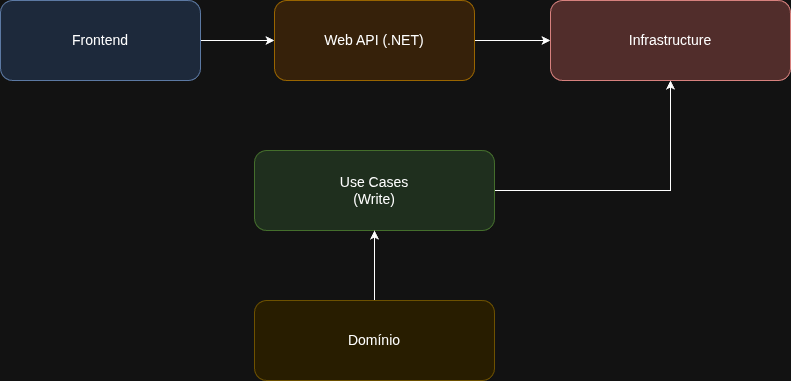
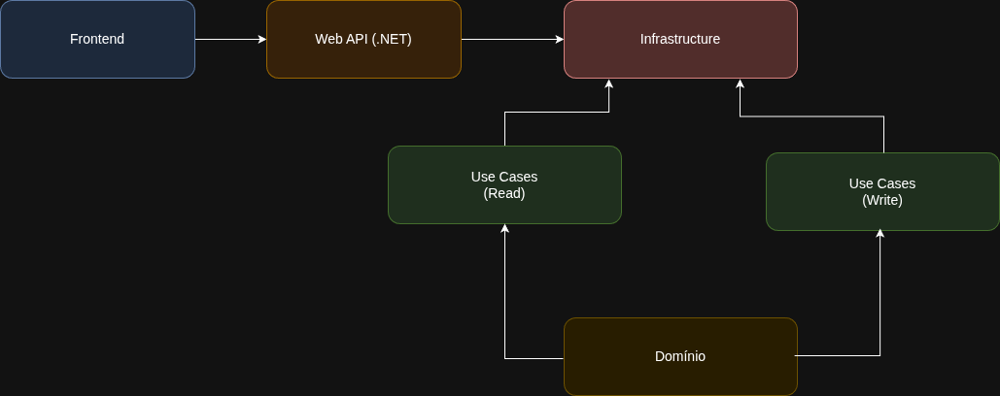
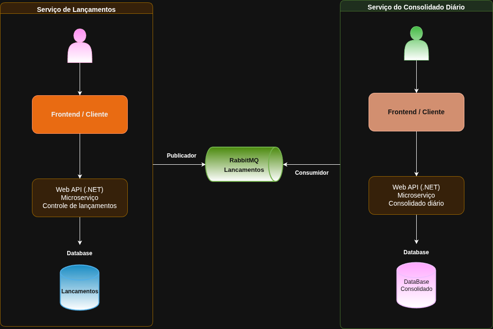

# ✅ Introdução – Arquitetura do Serviço de Controle de Lançamentos



O Serviço de Controle de Lançamentos foi projetado seguindo uma arquitetura moderna baseada em princípios de micro serviços, Clean Architecture, DDD (Domain-Driven Design) e CQRS (Command Query Responsibility Segregation).
O objetivo dessa estrutura é garantir alta manutenibilidade, baixa acoplabilidade, clareza de responsabilidades e evolução contínua do domínio financeiro, reduzindo impactos entre componentes e promovendo escalabilidade ao longo do tempo.
Esse micro serviço é responsável por registrar, validar e persistir lançamentos financeiros diários, incluindo créditos e débitos, garantindo consistência dos dados e integridade das regras de negócio. Ele atua como a camada de escrita do sistema financeiro, sendo a fonte primária de eventos que serão posteriormente consolidados por outros serviços.
posteriormente consolidados por outros serviços.

### A solução foi estruturada em múltiplas camadas, cada uma com responsabilidades bem definidas:

### 1. Web API (.NET) – Interface de Entrada

- A camada de API expõe os endpoints responsáveis por receber requisições externas (frontend, integrações e outros serviços).
  Ela não contém regras de negócio; sua função é apenas traduzir requisições HTTP para comandos de aplicação.


### 2. Application Layer (CQRS – Use Cases)

- Nesta camada ficam os Use Cases, implementados como Commands e Handlers.
  Cada operação de negócio (como registrar um lançamento) é tratada em um handler específico, garantindo simplicidade e isolamento da lógica.

- **Também residem aqui**: Validações, Orquestração de serviços, Interações com o domínio


### 3. Domain Layer (DDD)

**A camada de domínio contém**: Entidades financeiras, Regras de negócio. Essa camada representa o coração do micro serviço, sendo totalmente independente de infraestrutura.
Ela garante que a lógica financeira permaneça consistente mesmo com mudanças técnicas.

### 4. Infrastructure Layer

A camada de infraestrutura é responsável por: Persistência (EF Core, DbContext), Repositórios, Configurações de banco de dados, Integrações externas, se necessário ela implementa detalhes técnicos invisíveis para as camadas superiores.

### 5. Micro Serviços e Comunicação

O serviço pode expor eventos ou se integrar com outros micro serviços, como o serviço de Consolidado Diário.
Essa comunicação pode ser feita por: Mensageria (RabbitMQ, SQS), HTTP entre micro serviços, Eventos assíncronos (Outbox Pattern)


---


# ✅ Introdução – Arquitetura do Serviço de Consolidado Diário



O Serviço de Consolidado Diário foi projetado utilizando uma arquitetura moderna baseada em micro serviços, Clean Architecture, DDD (Domain-Driven Design) e CQRS.
Seu propósito é processar, agregar e disponibilizar o saldo diário consolidado a partir dos lançamentos financeiros registrados no sistema, garantindo consistência, precisão e performance na leitura de dados.

Esse micro serviço é responsável por:
1 - Calcular o total de créditos, total de débitos e saldo do dia.
2 - Organizar e projetar informações em modelos de leitura otimizados.
3 - Servir como a fonte de consulta para aplicações e relatórios que dependem de dados consolidados.
4 - Reagir a eventos ou dados provenientes do serviço de lançamentos.

Diferentemente do serviço de lançamentos, que atua na escrita do sistema, o serviço de consolidado diário atua principalmente na leitura e projeção dos dados, organizando-os em um formato pronto para consumo pelo frontend e integrações externas.

### 🧩 Arquitetura Estabelecida

A solução segue uma arquitetura separada por camadas, cada uma com sua responsabilidade distinta.

### 1. Web API (.NET) – Interface de Consulta
A camada de API expõe endpoints otimizados para leitura e consulta:
1. Recuperação do consolidado do dia
2. Listagem de dias consolidados
3. Detalhamento das movimentações de um dia específico
4. Ela não contém lógica de cálculo, apenas expõe dados já consolidados.


### 2. Application Layer (Queries / Use Cases)

Por ser um serviço orientado principalmente à leitura, esta camada concentra:
1. Responsáveis por recuperar e montar os dados do consolidado.
2. Orquestração de regras de agregação, quando necessário.
3. Lógica de acesso aos dados (tabelas, views ou projeções específicas de leitura).


### 3. Application Layer (Commands / Use Cases)

Esta é a camada responsável por processar e consolidar os dados recebidos do serviço de lançamentos.
Por ser um serviço orientado principalmente à escrita, esta camada concentra:

1. Recebem dados
2. Localizam o consolidado do período
3. Aplicam a agregação de crédito/débito
4. Atualizam os totais (Saldo, TotalEntradas, TotalSaidas)
5. Persistem o resultado

Essa camada faz o “trabalho pesado” da consolidação e representa a parte de escrita do micro serviço.


### 4. Infrastructure Layer

A camada de infraestrutura é responsável por: Persistência (EF Core, DbContext), Repositórios, Configurações de banco de dados, Integrações externas, se necessário ela implementa detalhes técnicos invisíveis para as camadas superiores.


---


### 🔄 2. Representação do Fluxo entre os microserviços





---


## 🔧 Configuração do Ambiente

### 1. Clonar o repositório

```bash
git clone https://github.com/ArturRibeiro/fluxo-de-caixa.git
cd fluxo-de-caixa
```
---

## 🐳 Docker Compose

A aplicação utiliza Docker Compose para subir a infraestrutura de desenvolvimento local (banco de dados PostgreSQL).

### 📂 Arquivo utilizado

O arquivo `compose.yaml` define os serviços necessários.

### ▶️ Subir os serviços


```bash
docker compose -f compose.yaml up -d
```
---


## ▶️ Executar a API

Após subir o banco com o Docker Compose, rode a API com:

## 🚀 1. Executando no Linux

### **Passos:**

```bash
dotnet clean
dotnet build

dotnet run --project src/Financeiro.App/Financeiro.App.csproj &
dotnet run --project src/Financeiro.Lancamento.Consolidado.App/Financeiro.Lancamento.Consolidado.App.csproj &
dotnet run --project src/Financeiro.Web.Api/Financeiro.Web.Api.csproj &
dotnet run --project src/Financeiro.Consolidado.Web.Api/Financeiro.Consolidado.Web.Api.csproj &

wait
```
## 🚀 2. Executando no Windows (PowerShell)

```bash
$p1 = Start-Process dotnet -ArgumentList "run --project src/Financeiro.App/Financeiro.App.csproj" -PassThru
$p2 = Start-Process dotnet -ArgumentList "run --project src/Financeiro.Lancamento.Consolidado.App/Financeiro.Consolidado.AppFinanceiro.Lancamento.Consolidado.App.csproj" -PassThru
$p3 = Start-Process dotnet -ArgumentList "run --project src/Financeiro.Web.Api/Financeiro.Web.Api.csproj" -PassThru
$p4 = Start-Process dotnet -ArgumentList "run --project src/Financeiro.Consolidado.Web.Api/Financeiro.Consolidado.Web.Api.csproj" -PassThru

Wait-Process -Id $p1.Id, $p2.Id, $p3.Id, $p4.Id
```

### 🌐 URLs dos Serviços

#### Frontend

- http://localhost:5041/
- http://localhost:5093/

#### APIs
- http://localhost:5260/swagger/index.html
- http://localhost:5279/swagger/index.html

### 📌 Serviços definidos:

1. **rabbitmq**
2. **Url**: http://localhost:15672/
3. **USER**: guest
4. **PASSWORD**: guest

### Base de dados: Serviço que faça o controle de lançamentos

1. **Porta**: 5432
2. **POSTGRES_DB**: lancamentos
3. **POSTGRES_USER**: postgres
4. **POSTGRES_PASSWORD**:password

### Base de dados: Serviço do consolidado diário

1. **Porta**: 5432
2. **POSTGRES_DB**: consolidados
3. **POSTGRES_USER**: postgres
4. **POSTGRES_PASSWORD**:password

---

